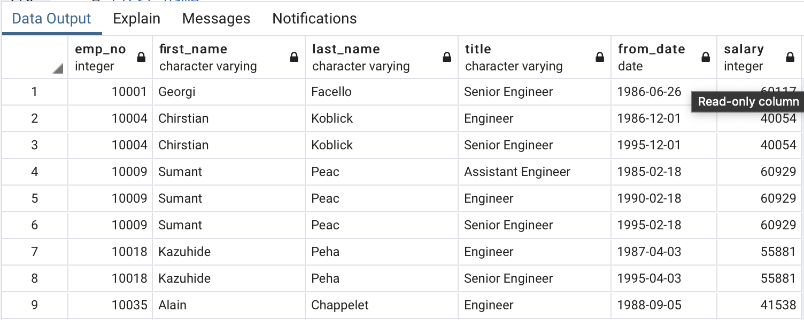
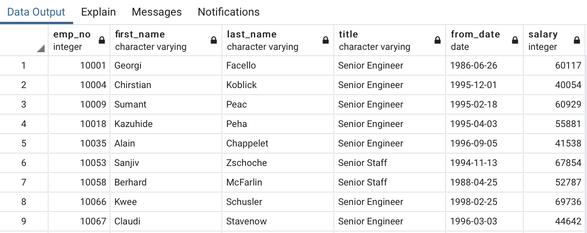
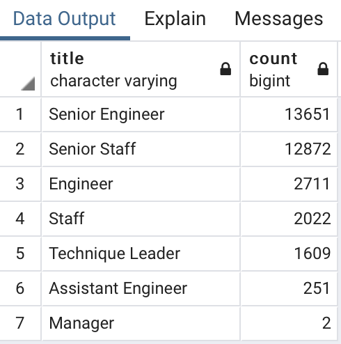

# Pewlett-Hackard-Analysis
## Description:
This project was conducted to help Pewlett Hackard company to determine the employees that might be a good candidate for the supervisory role as well as people who might be retired soon.

##  Tools:
Analysis was conducted based on 6 csv tables, that contain personal information of employees, departments, managers, salaries and titles.
Entity Relationship Diagram was built with the help of QuickDBD application
Further analysis, building relationships between tables and making queries were conducted in pgAdmin4 using PostgreSQL.

## Entity Relational Diagram

Entity Relational Diagram (ERD) was built using QuickDBD application. The main purpose of ERD is visualizing the data tables structure and understanding the relationships between them. 
During the project was built the following ERD:

## Number of titles retired
To determine the number of employees that might be retired soon was decided to build the new data table chal_retire_all (see chal_retire_all.scv). This table contains the following information about all employees of the company:
•	Employee number (emp_no)
•	First Name (first_name)
•	Last Name (last_name)
•	Title (title)
•	Date of hiring (from_date)
•	Salary (salary)

For building this table were used the following tables:
•	emp_info
•	titles

SQL query used:
SELECT ei.emp_no,
	ei.first_name,
	ei.last_name,
	ti.title,
	ti.from_date,
	ei.salary
	INTO chal_retire_all
	FROM emp_info as ei
	INNER JOIN titles AS ti
	ON (ei.emp_no = ti.emp_no)
	;
The Example of the output:

## Only the Most Recent Titles

In output it could be noticed that the table contains duplicated employees numbers (for example 10004). It could be explained with the fact that one employee might have different titles in the different period of time. For the analysis it’s necessary to take into account only the most recent title for each employee. To get the table with the most recent employees’ titles were build new table chal_retire_partition (chal_retire_partition.csv). To remove the previous titles was used PARTITION method with descending ordering by from_date column. So the most recent title for each employee occurred at first.

SQL query used:
SELECT emp_no,first_name, last_name, title, from_date, salary 
	into chal_retire_partition
	FROM
	  (SELECT emp_no, first_name, last_name, title, from_date, salary,
		 ROW_NUMBER() OVER 
	(PARTITION BY (emp_no) ORDER BY from_date DESC) rn
	   FROM chal_retire_all) tmp 
	   WHERE rn = 1;

The Example of the output:

To get a breakout of number of people who might be retired soon by department, was used the following SQL query:

select title, count(emp_no) 
	into title_retire_count
	from chal_retire_partition 
	group by title
	order by count(emp_no) desc;

The Example of the output:

## Who’s ready for a mentor?

To determine the people who might be a good fir for future mentors role was created new data table chal_emp_info (chal_emp_info.csv) like was done in previous section, but this table contained the information about all employees. Then was created data table chal_emp_partition (chal_emp_partition.csv) where were removed  previous titles of employees. 
To determine the employees who might be a good fit for the supervisory role was built new data table ready_for_mentor (ready_for_mentor.csv) that contains the following information:
•	Employee number (emp_no)
•	First Name (first_name)
•	Last Name (last_name)
•	Title (title)
•	Date of hiring (from_date)
•	Date of quitting (to_date)
People who might be a good candidate for mentoring should be born between 1/1/1965 and 12/31/1965 and be current employee (to_date should be ‘9999-01-01’).

For receiving this information was used the following SQL query:
SELECT cep.emp_no,
	cep.first_name,
	cep.last_name,
	cep.title,
	cep.from_date,
	ti.to_date
	into ready_for_mentor
	FROM chal_emp_partition as cep
	INNER JOIN titles AS ti
	ON (cep.emp_no = ti.emp_no)
	INNER JOIN employees AS e
	on (cep.emp_no = e.emp_no)
	WHERE (e.birth_date BETWEEN '1965-01-01' AND '1965-12-31')
		and (ti.to_date = '9999-01-01');

The Example of the output:

## Summary:
Conducted Analysis has showed that soon might be retired 33118 employees, mostly they have Senior Engineer and Senior Staff roles. HR department should decide how to fill that positions (are new people should be hired for that roles or should be filled with promoted current employees).
From the data table ready_for_mentor was obtained the information about 1549 employees that potentially might fill the supervisory roles. To select those candidate from this list who might be the best fit for mentoring is necessary to cooperate with HR department and to make an additional analysis based on years of experience, title etc.
