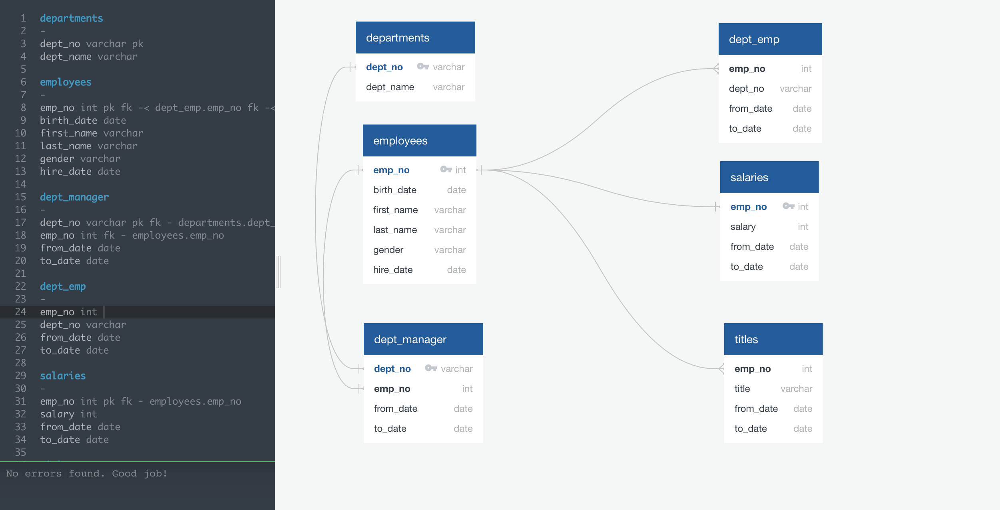

# Pewlett-Hackard-Analysis
## Description:
This project was conducted to help Pewlett Hackard company to determine the employees that might be a good candidate for the supervisory role.

##  Tools:
Analysis was conducted based on 6 csv tables, that contain personal information of employees, departments, managers, salaries and titles.
Entity Relationship Diagram was built with the help of QuickDBD application
Further analysis, building relationships between tables and making queries were conducted in pgAdmin4 using PostgreSQL.

## Entity Relational Diagram

Entity Relational Diagram (ERD) was built using QuickDBD application. The main purpose of ERD is visualizing the data tables structure and understanding the relationships between them. 
During the project was built the following ERD:

